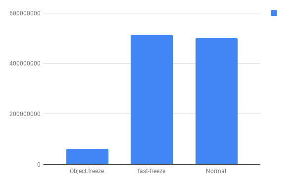

# fast-freeze
Ugly but fast read only object

This module actually don't freeze object but convert the object into nested functions. Hence accessing any propery seems ugly.

## How to use

Install like any npm package
```
npm i fast-freeze
```

then just use it

```js
var fastFreeze = require("fast-freeze");

var testConfig = {
    name: 'John',
    surname: 'Johnson',
    age: 26,
    address: {
        street: '1st Street',
        city: 'Los Angeles',
        country: 'USA'
    },
    vehicles: [
        'BMW',
        'Ferrari',
        'Lamborghini'
    ]
};

var frozenConfig = fastFreeze(testConfig);

console.log( frozenConfig("vehicles")[1] );
console.log( testConfig["vehicles"][1] );
```

## Benchmark

Object.freeze : 62130394.37862057 requests/second
fast-freeze : 514441747.5754436 requests/second
normal : 498987957.90934324 requests/second



